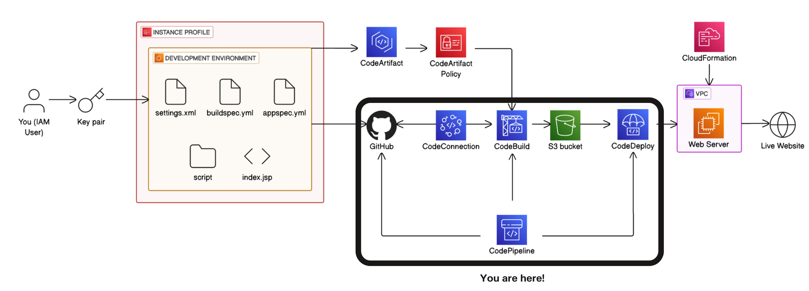
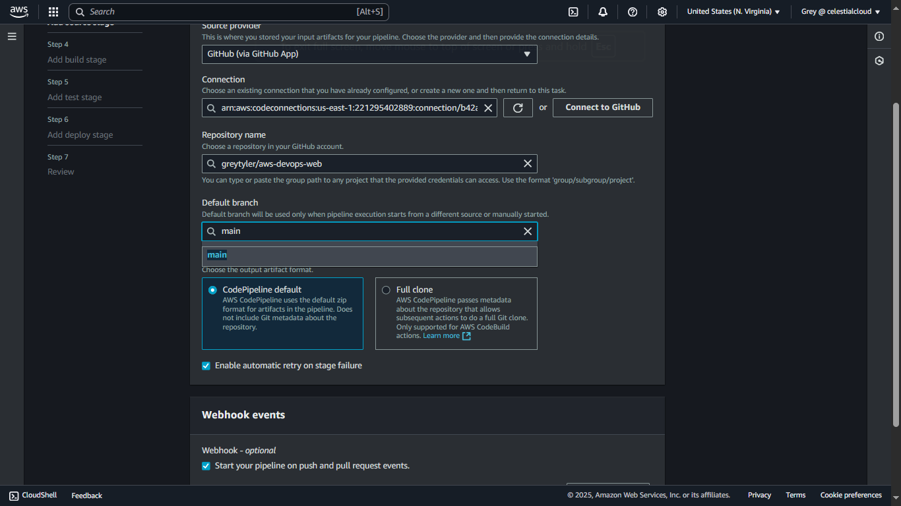
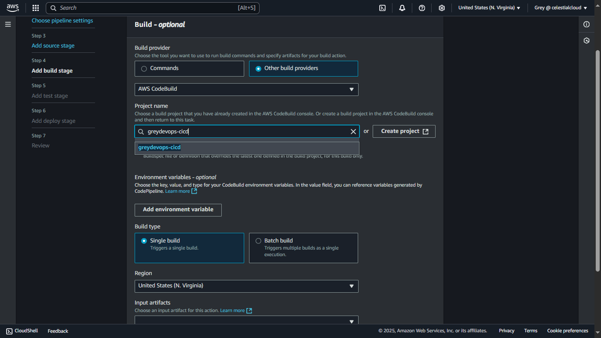
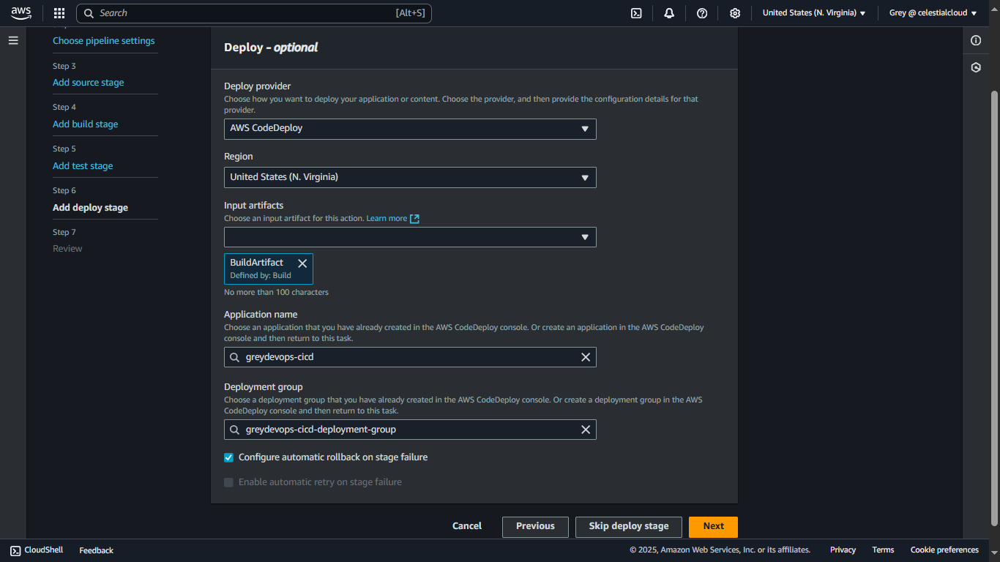
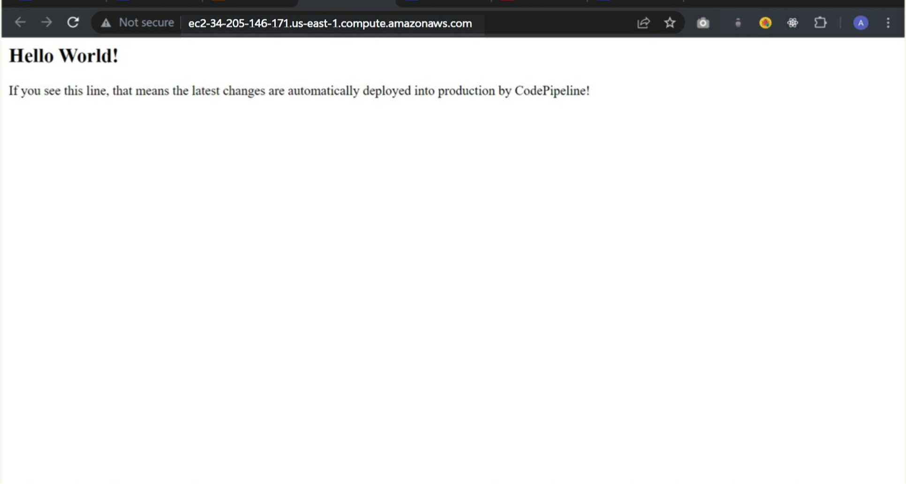

> ## AWS CI/CD Pipeline: Java Web App Deployment

#### Architecture


<br>

## 📌 Project Overview
 This project demonstrates a full CI/CD pipeline on AWS, automating code deployments from source to production. It integrates GitHub for version control, CodeBuild for compiling and testing, and CodeDeploy for rolling out updates to EC2 instances within a VPC. 
 The goal is to gain practical experience with cloud-native CI/CD using real AWS tools. 
 While the pipeline operates behind the scenes, it significantly improves and automates the release process for the Java web application.


## 🛠️ Tech Stack
***GitHub*** – Store and version the code

***AWS CodePipeline*** – CI/CD Orchestration

***AWS CodeBuild*** – Compilation and Testing

***AWS CodeDeploy*** – Automated EC2 Deployment

***AWS EC2*** –  software development and deployment happens entirely on the cloud.
 - Key pairs, SSH connections, Git, Maven and Java.

***AWS S3*** – Stores build artifacts

***AWS CloudFormation*** – Infrastructure as Code

***AWS CodeArtifact*** – Stores Maven dependencies (secured with policy)

***Java (Corretto 8)*** – Application Language

***Apache Maven*** – Build Tool
***Apache Maven*** – Build Tool
<br>

### 📂 Project Structure
> ###### AWS-DEVOPS-WEB/
>├── scripts/                     # Deployment lifecycle scripts
├── src/                         # Java source code
   ├── appspec.yml                  # CodeDeploy configuration
   ├── buildspec.yml                # CodeBuild build instructions
   ├── pom.xml                      # Maven project config
   ├── run-tests.sh                 # Custom test runner script
   └── settings.xml                 # Maven settings (CodeArtifact config)

<br>

###### 🧭 Architecture Flow

#### Source Stage

The Source stage in CodePipeline specifies the default branch to monitor for changes, ensuring the pipeline follows the correct code version. It also enables webhooks to automatically trigger the pipeline whenever new code is pushed to the linked GitHub repository.
<br>


#### Build Stage
The Build stage sets up a clean environment in CodeBuild to compile and test your application. I configured CodeBuild to run Maven on the files pulled from GitHub. The input artifact for the build stage is SourceArtifact
<br>


#### Deploy Stage
The Deploy stage uses AWS CodeDeploy to release the application to an EC2 instance. A configured deployment group ensures that build artifacts from CodeBuild are automatically deployed to the web app.
<br>



#### Access live Site

I tested my CI/CD pipeline by updating `index.html` with a deployment confirmation message and pushing to the main branch. This triggered the pipeline, where AWS CodeBuild built and tested the app, then CodeDeploy handled deployment. 

Each stage showed the commit message, reflecting smooth AWS service coordination. After successful execution, I verified the deployment by opening the app’s Public IPv4 DNS and confirmed the updated content was live.
<br>



---
<br>

###### 🧪 Future Improvements
- Add notifications using SNS or Slack.
- Use Elastic Load Balancer and Auto Scaling for high availability.
- Parameterize templates for multi-environment deployment (Dev, Staging, Prod).


---

## Setup
To get this project up and running on your local machine, follow these steps:

1. Clone the repository:
    ```bash
    git clone https://github.com/greytyler/aws-web-project.git
    ```
2. Navigate to the project directory:
    ```bash
    cd aws-web-project
    ```
3. Install dependencies:
    ```bash
    mvn install
    ```

<br>

##### 📬 Contact
- 📧 [Email Me](mailto:aubreytdube19@gmail.com)
- 🐙 [GitHub](github.com/greytyler)
- 💼 [LinkedIn](https://www.linkedin.com/in/aubrey-t-dube-194896288/)
- 📝 [Visit Blog](https://greystack.hashnode.dev)


<br>

 

