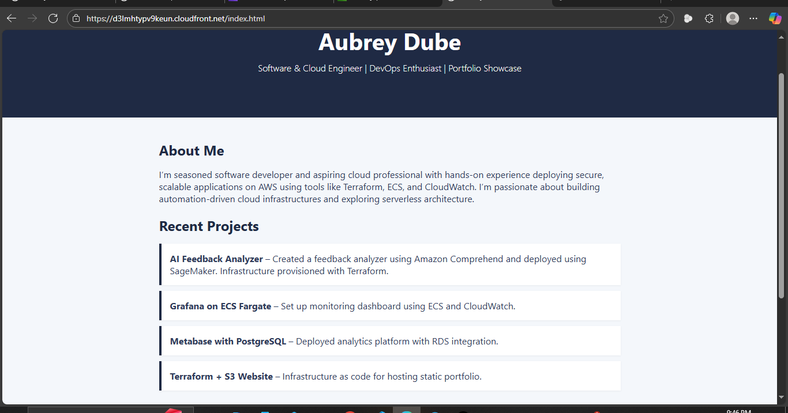
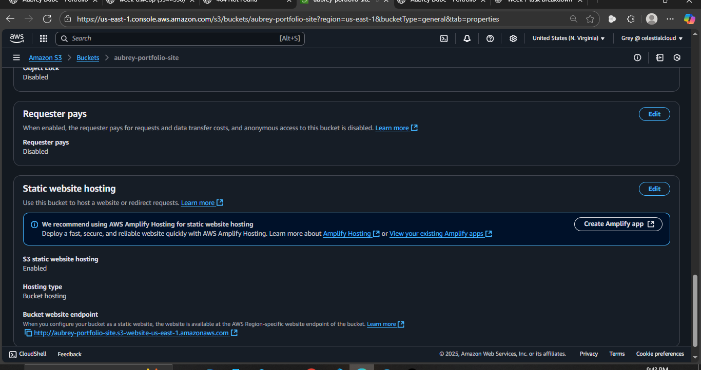
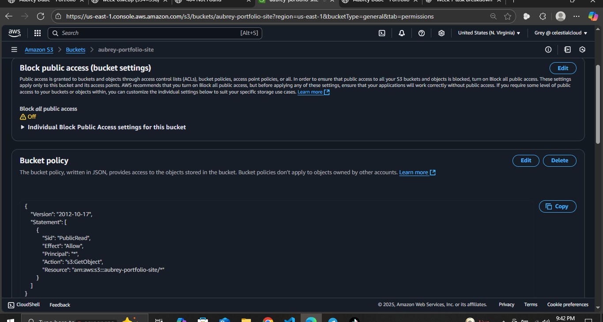

# 🌐 Personal Portfolio Website — AWS S3 + CloudFront

This project showcases a **simple, responsive, and minimalistic portfolio website** hosted on **Amazon S3** and delivered globally using **AWS CloudFront**.

> ✅ Built within AWS Free Tier limits

---

#### 🚀 Live URL (via CloudFront)

[https://your-cloudfront-url.cloudfront.net](#)  



---

### 📁 Features

- Responsive navy blue, grey, and white layout using pure HTML/CSS/JS
- Highlighted sections for:
  - DevOps tools and experience
- Deployed securely using AWS services

---

### 🛠️ Tech Stack

- **Frontend**: HTML5, CSS3, Vanilla JavaScript
- **Cloud**: Amazon S3 (hosting), AWS CloudFront (CDN + HTTPS)

---

### 🧱 Architecture

```text
[Local HTML/CSS/JS Files]
        |
        v
[AWS S3 Bucket with Static Website Hosting]
        |
        v
[CloudFront Distribution (HTTPS)]

```

### 📦 Folder Structure
```
📁 images/
📄 index.html
📄 styles.css
📄 script.js
```

---

### 🧪 Deployment Steps

#### 1. S3 Bucket Setup

- Created bucket with a unique name
- Enabled "Static website hosting"
- Uploaded `index.html`, CSS, JS, and assets to the **bucket root** (not a folder)
- Configured public read access with a bucket policy

<p float="left">
  
  
</p>

📸 *Screenshot Placeholder: S3 static hosting settings*

📸 *Screenshot Placeholder: Uploaded file structure in S3*

---

### 2. CloudFront Distribution

- Linked S3 static website endpoint as origin
- Set viewer protocol to **redirect HTTP to HTTPS**
- Created distribution and waited for deployment

📸 *Screenshot Placeholder: CloudFront distribution settings*

📸 *Screenshot Placeholder: CloudFront domain in browser*

---

## 🧼 Clean-Up Instructions

To stay within the Free Tier:
- ❌ Delete all objects from S3
- ❌ Delete the S3 bucket
- ❌ Delete the CloudFront distribution


---

## 📝 License

MIT License — feel free to use the template.
